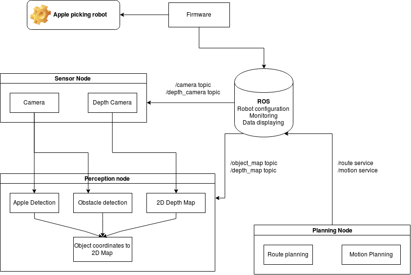

# Table of content

1. [Architecture](#architecture)
   - [What it is self driving apple picking robot and what it is not](#what-it-is-self-driving-apple-picking-robot-and-what-it-is-not)
   - [General concept of self driving car](#general-concept-of-self-driving-car)
   - [Apple picking robot architecture](#apple-picking-robot-architecture)

# Architecture

## What it is self driving apple picking robot and what it is not

Before to start thiking of what it is we should understand __what is the minimum we want to build__, we need to create description of [Minimum Viable Product](https://en.wikipedia.org/wiki/Minimum_viable_product) although we are not building product we need to understand something about what we are building.

Apple picking Robot characteristics of minimum functionality point of view dividing by modules:

|    Functionality             |        Module            |    Inputs            |       Possible How       | Level   |
|------------------------------|--------------------------|----------------------|--------------------------|---------|
| Locate apples                | Perception, Detection    | Camera, Depth camera | Deep Learning            | easy    |
| Navigate to closest apple    | Route Planning           | Camera, Map, Other   | Planning algorithms      | medium  |
| Scene understanding          | Perception, Detection    | Camera, Other        | Localization algos, DL   | medium  |
| Pick apple and put in basket | Perception, Planning     | Camera, Other        | Motion planning, DL      | hard    |

Note that robot must be controlable which means that we cannot use some black box which do everything and hope for the best.

Now that we know what robot have to do let's understand what it is. It is simplified self driving car which have starting point and destination point. It is robot, with robotic arm. And those components are not related altough both system may use same sensory inputs which means that both components must be interconnected.

## Simplified self driving car architecture

General architecture proposed for self driving cars. Briefly describes how we would build self driving car architecture and later discuss how we can apply this to our architecture.

### Sensor subsystem

Collect and pass camera, Depth camera, Lidar, Radar, GPS data to Perception subsystem.

### Perception subsystem

Responsible for detecting apples, obstacles, boundaries as well as localize itself in environment.

### Planning subsystem

1. Route planning

    The route planning component is responsible for high-level decisions about the path of the vehicle between two points on a map; for example which roads, highways, or freeways to take. This component is similar to the route planning feature found on many smartphones or modern car navigation systems.

2. Prediction

    The prediction component estimates what actions other objects might take in the future. For example, if another vehicle were identified, the prediction component would estimate its future trajectory.

3.  Behavioral planning

    The behavioral planning component determines what behavior the vehicle should exhibit at any point in time. For example stopping at a traffic light or intersection, changing lanes, accelerating, or making a left turn onto a new street are all maneuvers that may be issued by this component.

4. Trajectory planning

    Based on the desired immediate behavior, the trajectory planning component will determine which trajectory is best for executing this behavior.

### Controll subsystem

Make sure that vehicle follow the path issued by Planning subsystem. This subsystem is responsible for sending following values to robot:

1. Acceleration
2. Braking
3. Steering

## Apple picking robot architecture

 