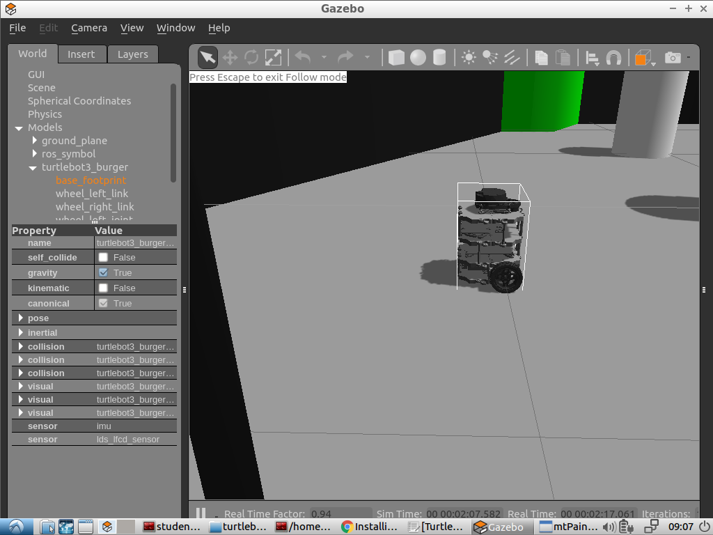

### How to install turtlebot3_simulator

* Very usefull link how to work with turtlebot3 [here](http://cyaninfinite.com/tutorials/installing-tb3-simulator-in-ubuntu14-04)

* But I had some issues with packages installing and I begun investigation from git clonning repositories below. You should clone them to catkin_WS source directory.

# Tutlebot3 the main repo

* git clone https://github.com/ROBOTIS-GIT/turtlebot3.git

# Tutlebot3 repo for message exchanging

* git clone https://github.com/ROBOTIS-GIT/turtlebot3_msgs.git

# Tutlebot3 repo for simulatots

* git clone https://github.com/ROBOTIS-GIT/turtlebot3_simulations.git

# Tutlebot3 repo for keyboard connection

* git clone https://github.com/ros-teleop/teleop_twist_keyboard.git

# Tutlebot3 repo for joystick connection

* git clone https://github.com/ros-teleop/teleop_twist_joy.git 

* After that you should compiled all with catkin_make. 

* You can see a mistake like that:

CMake Error at /opt/ros/kinetic/share/catkin/cmake/catkinConfig.cmake:83 (find_package):
  Could not find a package configuration file provided by "amcl" with any of
  the following names:

    amclConfig.cmake
    amcl-config.cmake

  Add the installation prefix of "amcl" to CMAKE_PREFIX_PATH or set
  "amcl_DIR" to a directory containing one of the above files.  If "amcl"
  provides a separate development package or SDK, be sure it has been
  installed.
Call Stack (most recent call first):
  turtlebot3/turtlebot3_navigation/CMakeLists.txt:10 (find_package)

-- Configuring incomplete, errors occurred!
See also "/home/student/catkin_ws/build/CMakeFiles/CMakeOutput.log".
See also "/home/student/catkin_ws/build/CMakeFiles/CMakeError.log".
Invoking "cmake" failed

* This mistake doesn't affect our simulation.

* Please, check all above packages dependences we have, use for example:

rosdep check turtlebot3_gazebo

* If you find some dependenses please, install all of them use:

rosdep -i install  turtlebot3_gazebo

* After that you should activate you  developing space:

source ¬/devel/setup.bash

* Don't forget your  turtlebot model. Burger is more suitable to IRobot.

export TURTLEBOT3_MODEL="burger"

* And just launch your world package:

roslaunch turtlebot3_gazebo turtlebot3_world.launch

* For using keyboard you should open another terminal and do the same steps from catkin_make compiling. Instead world launching just execute this:

   rosrun teleop_twist_keyboard teleop_twist_keyboard.py

* We can add a button which 'picks an apple' in this file I think.

