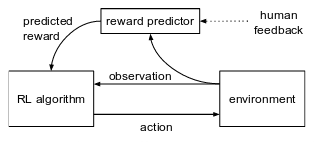
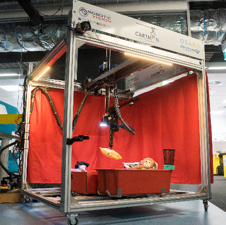
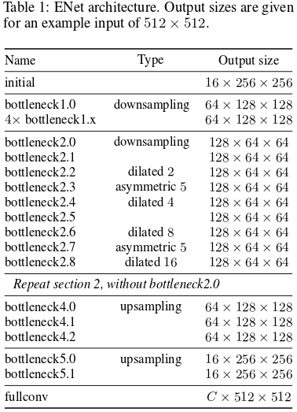
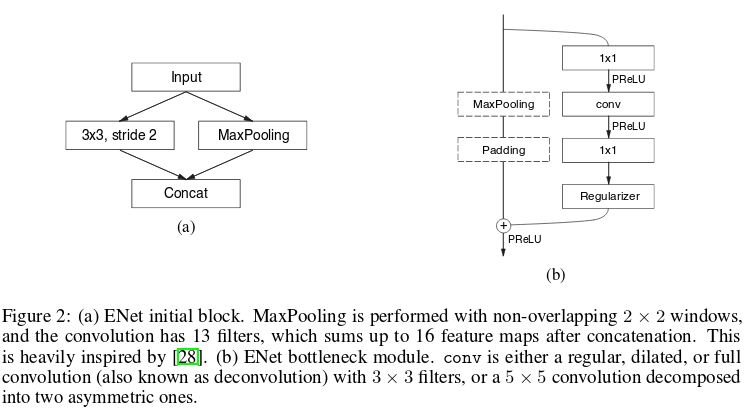

# Paper review

1. Reinforcement learning:
    * [Ground Language Learning in a Simulated 3D World](#ground-language-learning-in-a-simulated-3d-world), [Local](ground_language_learning_in_a_simulated_3d_world.pdf), Reviewed
    * [Deep Reinforcement Learning from Human Preferences](#deep-reinforcement-learning-from-human-preferences), [Online](https://arxiv.org/pdf/1706.03741.pdf), Reviewed
    * [Neural Task Programming: Learning to Generalize Across Hierarchical Tasks](#neural-task-programming-learning-to-generalize-across-hierarchical-tasks), [Online](https://arxiv.org/abs/1710.01813?utm_campaign=Revue%20newsletter&utm_medium=Newsletter&utm_source=The%20Wild%20Week%20in%20AI)
    * [Rainbow: Combining Improvements in Deep Reinforcement Learning](#rainbow-combining-improvements-in-deep-reinforcement-learning), [Online](https://arxiv.org/abs/1710.02298?utm_campaign=Revue%20newsletter&utm_medium=Newsletter&utm_source=The%20Wild%20Week%20in%20AI)
    * [Learning to Push by Grasping: Using multiple tasks for effective learning](#learning-to-push-by-grasping-using-multiple-tasks-for-effective-learning), [Online](https://arxiv.org/pdf/1609.09025.pdf)

2. Hardware

    * [Mechanical Design of a Cartesian Manipulator for Warehouse Pick and Place](#mechanical-design-of-a-cartesian-manipulator-for-warehouse-pick-and-place), [Online](http://juxi.net/papers/ACRV-TR-2017-02.pdf), Reviewed

3. Computer Vision

    * [ENet: A Deep Neural Network Architecture for Real-Time Semantic Segmentation](#enet-a-deep-neural-network-architecture-for-real-time-semantic-segmentation), [Online](https://arxiv.org/pdf/1606.02147.pdf), Reviewed

---

# Reinforcement Learning

## [Ground Language Learning in a Simulated 3D World](https://arxiv.org/abs/1706.06551)

### Abstract

Novel paradigm for simulating language learning and understanding. The goal of the paper is to teach the agent to do specific tasks using natural language command and visual input, for example in this implementation.

The agent will receive positive points for picking specified object, and negative points for other objects. Optimization step is performed when the replay memory buffer is full, and then cleared.

Address longstanding challenge of relating language to the physical world. Talking to machines in a natural language and tell them what to do.

### Up-sides

* The speed of learning new semantics increases as more semantics are learned.
* No rule based approach. System learns how to act based on input phrase.
* End-to-End system. Based on pixel inputs.
* Generalizes well. Authors constructed more complex tasks pretraining to other characteristics of human language understanding such as understanding new phrases and able to find not seen before object.
* Unofficial. Resulted code can be found, (PyTorch, Python 2.7), environment code in LUA, no comparable results with DeepMinds work: https://github.com/dai-dao/Grounded-Language-Learning-in-Pytorch

### Useful for us

* How to process and relate textual input to surrounding environment - 3D world.
* If everything works out great then we could build more general system for picking different objects and not only.

### Challenges

* This approach have been tested only in Virtual Environment so there are no results and challenges described for real life scenario. Learning is very slow which mean that in real life we should have to figure out how to maintain __very long and repeatable (by machine) learning mechanics or we could train in supervised manner before.__
* Authors experimented in a complex virtual 3D world however actions was limited to move to the place we need and there wasn't picking up and moving to somewhere actions involved which raises a question - __how we would solve this and if this is right approach for this job?__ Agents can provide multiple simultaneous actions to control movement (forward/back, strafe left/right, crouch, jump), looking (up/down, left/right) and tagging (in laser tag levels with opponent bots).
* Reward system construction in real life is much harder than in virtual environment, this could be challenge as we may need to create separate system just to reward our agent (apple picker).
* Although 3D simulated world was randomly filled with millions of different objects with different colors and different places. Environment is very simplified uniformly coloring objects and surrounding as well as image inputs always are clear, steady and without any noise which comes in real life. Figure 1 in paper: "This  exploration  and  selection  behaviour  emerges  entirely  from  the reward-driven learning and is not preprogrammed.  When training on a task such as this."
there  are  billions  of  possible  episodes  that  the  agent  can  experience,  containing  different objects in different positions across different room layouts."
* RL policy optimized by Advantage Actor Critic algorithm. They run 32 async thread parallel (32 agents) which itself is a big challenge for physical world. 6 million episodes learning from scratch.
* Comment from [Reddit](https://www.reddit.com/r/MachineLearning/comments/6im2r8/r_from_deepmind_grounded_language_learning_in_a/): "Their solutions don't scale to real world robotics: no hands, no touch input, no audio input, no 50-dimensional continuous motor actions."

## [Deep Reinforcement Learning from Human Preferences](https://arxiv.org/pdf/1706.03741.pdf)

### Abstract

Train RL agent without reward function providing human feedback on less than 1% of agent's iterations with the environment. Train complex novel behaviours with about an hour of human time.

Authors approach is to learn a reward function from human feedback and then to optimize that reward function. This basic approach has been considered previously, but we confront the challenges involved in scaling it up to modern deep RL and demonstrate by far the most complex behaviors yet learned from human feedback.

__Speaking of behavioral cloning:__

If we have demonstrations of the desired task, we can extract a reward function using inverse reinforcement learning (Ng and Russell, 2000). This reward function can then be used to train an agent with reinforcement learning.  More directly, we can use imitation learning to clone the demonstrated behavior. However, these approaches are not directly applicable to behaviors that are difficult for humans to demonstrate (such as controlling a robot with many degrees of freedom but very non-human morphology).

### Up-sides

* Tested in physics simulator MuJoCo as well as on Atari games.
* No need of reward function
* Only 1% of agents interactions needed for training
* Experiment details provided
* Unofficial. Code [available](https://github.com/nottombrown/rl-teacher). Tensorflow. Python 3.x.

### Useful for us

* It’s not clear how to construct a suitable reward function, which will need to be a function of the robot’s sensors. We could try to design a simple reward function that approximately captures the intended behavior,  but this will often result in behavior that optimizes our reward function without actually satisfying our preferences.

### Challenges

* Algorithm is tested in physics simulator however there are no proof that this approach would scale for real life scenarios such as robotics arm
* For real life scenarios this would be that learning should happen in real time with human feedback

## [Neural Task Programming Learning to Generalize Across Hierarchical Tasks](https://arxiv.org/abs/1710.01813?utm_campaign=Revue%20newsletter&utm_medium=Newsletter&utm_source=The%20Wild%20Week%20in%20AI)

### Abstract
In this work, we propose a novel robot learning framework called Neural Task Programming (NTP), which bridges the idea of few-shot learning from demonstration and neural program induction. NTP takes as input a task specification (e.g., video demonstration of a task) and recursively decomposes it into finer sub-task specifications. These specifications are fed to a hierarchical neural program, where bottom-level programs are callable subroutines that interact with the environment. We validate our method in three robot manipulation tasks. NTP achieves strong generalization across sequential tasks that exhibit hierarchal and compositional structures. The experimental results show that NTP learns to generalize well towards unseen tasks with increasing lengths, variable topologies, and changing objectives.

## [Rainbow: Combining Improvements in Deep Reinforcement Learning](https://arxiv.org/abs/1710.02298?utm_campaign=Revue%20newsletter&utm_medium=Newsletter&utm_source=The%20Wild%20Week%20in%20AI)

### Abstract
The deep reinforcement learning community has made several independent improvements to the DQN algorithm. However, it is unclear which of these extensions are complementary and can be fruitfully combined. This paper examines six extensions to the DQN algorithm and empirically studies their combination. Our experiments show that the combination provides state-of-the-art performance on the Atari 2600 benchmark, both in terms of data efficiency and final performance. We also provide results from a detailed ablation study that shows the contribution of each component to overall performance.

## [Learning to Push by Grasping: Using multiple tasks for effective learning](https://arxiv.org/pdf/1609.09025.pdf)

### Abstract
Recently, end-to-end learning frameworks are gaining prevalence in the field of robot control. These frameworks input states/images and directly predict the torques or the action parameters. However, these approaches are often critiqued due to their huge data requirements for learning a task. The argument of the difficulty in scalability to multiple tasks is well founded, since training these tasks often require hundreds or thousands of examples. But do end-to-end approaches need to learn a unique model for every task? Intuitively, it seems that sharing across tasks should help since all tasks require some common understanding of the environment. In this paper, we attempt to take the next step in data-driven end-to-end learning frameworks: move from the realm of task-specific models to joint learning of multiple robot tasks. In an astonishing result we show that models with multi-task learning tend to perform better than task-specific models trained with same amounts of data. For example, a deep-network learned with 2.5K grasp and 2.5K push examples performs better on grasping than a network trained on 5K grasp examples.

# Hardware

## [Mechanical Design of a Cartesian Manipulator for Warehouse Pick and Place](http://juxi.net/papers/ACRV-TR-2017-02.pdf)

### Abstract

Robotic manipulations and grasping in cluttered and unstructured environments is a current challenge for robotics. One of main challenges associated with these difficult robotic manipulations tasks is the motion palling and control problem for multi-DoF (Degree of Freedom). This paper presents the design and  performance evaluation of a novel low cost Cartesian manipulator, Cartman who  took  first  place  in  the  Amazon Robotics  Challenge  2017. Cost is < 10000 AUD

Cartman, a cartesian manipulator for pick and place applications. Cartman is composed of six degrees of freedom; three prismatic joints which form the x, y and z axes and three revolute joints and a multi-modal end effector for grasping a large range of items.

### Up-sides

* The complete design will be open sourced and will be available at the time of ICRA 2018
* Autonomously pick and place a variety of household item

### Useful for us

* Design
* They are using ROS (Robotic Operating System)

### Challenges

* Cost
* Size

# Computer Vision

## [ENet: A Deep Neural Network Architecture for Real-Time Semantic Segmentation](https://arxiv.org/pdf/1606.02147.pdf)

2016, 7. June
Code: https://github.com/kwotsin/TensorFlow-ENet

Spotted mistake in 4th page, Decoder size section (2, 3 line), should be "as the decoder is an exact mirror of the encoder" and not "as the encoder is an exact mirror of the encoder".

Great paper!

### Abstract

Real-time pixel-wise segmentation is very difficult because embedded devices is not there yet, even NVidia TX2 which is probably most powerful pocket size super computer available wouldn't be able to process real time semantic segmentation, not speaking about other processing needed for robot to function.

ENet is up to 18× faster, requires 75× less FLOPs, has 79× less parameters, and provides similar or better accuracy to existing models but note that this is 2016 year.

We present performance measurements of the proposed architecture on embedded systems and suggest possible software improvements that could make ENet even faster.

Uses encoded-decode architecture similarly to traditional FCNs. It is divided into several stages, as highlighted by horizontal lines in the table and the first digit after each block name.

More than 10FPS in NVidia TX1 with an input image size 640×360.

### Up-sides

* Semantic segmentation gives us ability recognize objects shape which may increase precision of robot decisions
* Benchmarked on Cityscapes, CamVid and SUN datasets

### Useful for us

* We only need to localize single object therefor there is no reason for us to choose deeper detection or segmentation neural networks which probably would work similarly to this one

### Challenges

* Harder to train than object detection network simply because training data set availability is much smaller than for bounding box data sets. Also creating data set manually will take longer time.
* We may not need semantic segmentation for current task because we either may find shape of apple by using other Computer Vision tools or just bounding box is enough.

### Further ideas

* Instead of using PReLU activations and batch normalization use SELU activation to further increase speed.